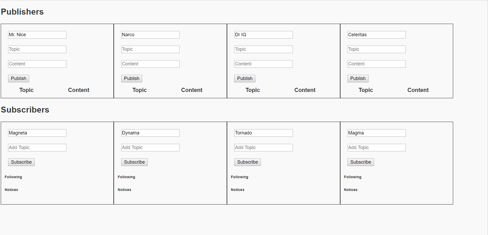
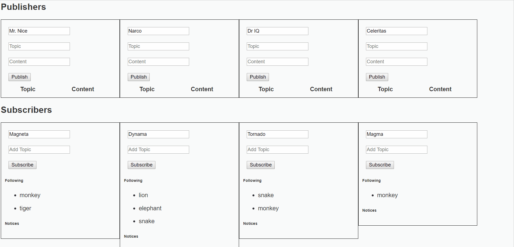

# Pub/Sub Model using Angular-Springboot-Mongodb
This is a topic based Publish/Subscribe Messaging system. In this model, any message published by the publisher to a topic, is immediately received by all the subscribers of the topic.

## Getting Started
Following instructions will get you a copy of the project up and running on your local machine for development and testing purposes.

### Pre-requisites:
1. Maven - 3.x.x
2. NodeJS - 8.x or 10.x
3. MongoDB
4. Angular CLI

### Steps to Setup:

The application has 3 parts:

1. **Clone the application**
```bash
git clone https://github.com/PrachiP23/pubsub-angular-springboot-mongodb.git
```

2. **Build and run the backend app using maven**
```bash
cd SpringMongoDb
mvn package
java -jar target\spring-boot-rest-mongodb-0.0.1-SNAPSHOT.jar
```

The backend server will start at <http://localhost:8080>.

3. **Run the frontend Angular app using npm**
```bash
cd AngularApp
npm install
npm start
```
Frontend server will run on <http://localhost:4200>.

### App Demo:
1. **Subscribe to topics**  

  


2. **Publish Message**  
    Notify message to the subscribers of the topic.  


